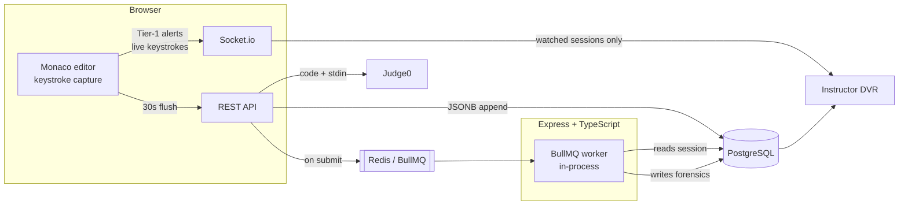

# CoDecep

**A forensic anti-cheat platform for university programming exams.**

CoDecep is a self-contained exam environment — a browser IDE students sit their
practical in, and an instructor console that reconstructs how the code was
written. It records exam-session behaviour and surfaces **probabilistic signals
for human review**. It does not grade, it does not auto-fail, and it never
claims to have proven anything.

**Live instance:** https://codecep-619efa276de0.herokuapp.com/

> The hosted instance is a deployment credential — it demonstrates the system
> running as a real single-app deploy. The **full experience is local**: the live
> DVR "ghost typer" is a latency-sensitive feature, and a local run gives it a
> loopback network instead of a shared dyno. See
> [Running locally](#running-locally) and [Deployment notes](#deployment-notes).


*The student's exam screen. The question sheet renders beside the editor, the
file panel separates source from data files, and the terminal shows the actual
compile command, the stdin that was sent, the program's output and the run
verdict — here `Sum is: 12`, `Accepted (0.004s · 1248 KB)`. The top bar carries
the exam mode (`LIVE_LAB`), the countdown, Run and Submit.*

---

## Overview

Invigilating a programming exam is hard. In a lab you can watch the room but not
forty screens; remotely you can watch neither. The usual answers — lockdown
browsers, webcam proctoring, plagiarism diff tools — either fight the operating
system or look only at the *final artefact*, long after the interesting part is
over.

CoDecep takes a different angle: **the process of writing code is itself
evidence.** A program that was typed leaves a keystroke stream with rhythm,
hesitation, typos and rewrites. A program that was pasted leaves almost nothing.
Between those extremes are patterns worth a second look — and a second look by a
person, which is the whole design.

Every claim the system makes is framed the same way: *a probabilistic signal
that requires instructor review.* A red cell in the report means "flagged for
review", never "cheated". The instructor watches the replay, reads the context,
and decides. Several design decisions in this repository exist specifically to
keep that promise honest — metrics that cannot be computed report **"not
assessable"** rather than a passing grade, counters that were never recorded
render as **"not recorded"** rather than zero, and a reconstruction that cannot
be verified against stored snapshots labels itself **"approximate replay"**
rather than showing a plausible fiction.

---

## Key features

### Capture and reconstruction

- **Exact per-keystroke telemetry.** Every edit is recorded as the editor
  reported it — insert position, replaced range, inserted text — plus the file
  and task it happened in. Telemetry is buffered in the browser and flushed to
  the server every 30 seconds.
- **DVR replay.** Instructors replay a session as it was written: play/pause,
  1×–25× speed, scrubbing, skip-idle-gaps, and a timeline marked with pastes,
  AST violations and screen-leave events. The reconstruction is **verified
  against the snapshot stored at every flush**; where it matches it is labelled
  "exact replay", and where it cannot be verified it says "approximate replay".
- **Live "ghost typer".** An instructor can watch a student type in near
  real-time over Socket.io, and rewind within the live session. Streaming only
  happens while a session is actually being watched, and nothing on the live
  path is ever persisted — the durable record is the same 30-second flush either
  way.


*The replay transport — play, speed, skip-idle-gaps, a scrubber and a
`00:00 / 00:13` clock — with the file tab marked **exact replay**. The editor is
blank because the playhead sits at the start of the session, before the first
keystroke. Below it is the instructor's read-only run panel, which states in the
UI that it records no keystrokes and does not count towards the student's run
count.*

### Forensic signals (all probabilistic, all for review)

| Signal | What it looks at |
|---|---|
| **Authorship** | How much of the submitted program can be accounted for by typing, in characters — typed vs pasted |
| **Paste detection** | Clipboard and bulk insertions, with **internal/external provenance** (pasting your own earlier code is not pasting a solution) |
| **Typing rhythm** | Variance in inter-keystroke timing; reports *not assessable* when there was too little genuine typing to judge |
| **Linear typing** | Text entered front-to-back with almost no deletion or revision |
| **Run count** | How many times the student actually compiled and ran |
| **Screen leave** | Tab-outs, via the Page Visibility API |
| **Construct checking** | A Tree-sitter C++ parse against a **per-week syllabus allowlist** — "used a construct not permitted for this week", named with file and line |

Signals are computed **per task and per file**, not just per session — a fully
pasted question inside an otherwise honest exam is exactly the case a
session-wide average hides. The review flag is *any task flagged on any signal*,
and the report names which task and which signal.


*A submitted session's report. Each signal is stated in plain language with its
technical name underneath: two are **flagged for review** (red), typed-vs-pasted
reads **100% typed — no flag** (green), and typing rhythm reports **"not
assessable — see authorship"** rather than inventing a verdict from too little
typing. The 👍/👎 controls record whether the instructor thought an assessment
was accurate; the note beside them states that nothing is retuned automatically
and no judgment changes any student's result. Below, the factual counters —
screen-leaves, outside pastes, disallowed constructs — and the submit-time check
reporting `1 file(s) clean`.*

The syllabus allowlist is built by uploading the course syllabus PDF; **Gemini**
extracts a per-week construct list, and the instructor edits and confirms it
before anything is saved. A baseline of constructs every C++ program needs is
always unioned in, so `std::cout` can never be reported as a violation.


*The allowlist Gemini produced from `PF-Course-Syllabus.pdf`, before it counts
for anything. The banner says it plainly — "AI-generated from your syllabus —
review and adjust before saving" — and each week is an editable set of
Tree-sitter node types the instructor can add to or remove. Weeks are
cumulative, and nothing is enforced until a human presses **Save Allowlist**.*

### Instructor tooling

- **Live monitoring grid** — one tile per student, live alert counters, tiles
  that flag on a Tier-1 alert and cool to "had violations" rather than back to
  calm.
- **Run the submitted code.** An instructor can execute a submitted session's
  stored files with **their own stdin**, to test cases the student never tried.
  It is strictly read-only: the handler contains no database write at all, so it
  cannot move the student's run count or telemetry.
- **Metric review collection.** An optional 👍/👎 beside each behavioural metric
  records whether the instructor thought it was accurate, paired with what the
  metric predicted. It **collects only** — nothing auto-tunes a threshold, by
  design.

### Exam model and access control

- **Multi-file workspaces** (`.cpp` / `.h` plus `.txt` / `.csv` / `.dat` data
  files) so OOP and file-I/O exams work properly, compiled and linked together.
- **Multi-task exams** — up to 6 independent tasks in one sitting, each with its
  own workspace and its own forensics.
- **Sandboxed execution** via Judge0, with batch stdin.
- **Instructor-scheduled wall-clock exam windows** — shared by the cohort, so
  two students who start an hour apart still close at the same instant.
  Enforced server-side, on the server's clock.
- **Optional network restriction** (IP and CIDR allowlist), scoped per class.
  Deliberately described in the UI as a deterrent, not a guarantee — it is
  VPN-defeatable and says so.
- **Two exam modes.** A `LIVE_LAB` and a take-home `ASSESSMENT` surface
  different signals: tab-outs and run counts are meaningless for homework, so
  they are withheld there — and the report *states* that they were withheld
  rather than quietly showing less.
- **Two UI themes**, and a PDF pane for the question sheet.


*Class-level setup. The network restriction is off here, and the copy says
exactly what it does when on — students can only **open** an exam from an allowed
address, which "deters casual off-network access". It shows the address the
server actually sees the instructor arriving from, with a one-click "+ Add mine",
because the easiest way to lock out a whole cohort is to guess the range.*


*Scheduling an exam. Opens-at and closes-at are **wall-clock times shared by
every student**, as the help text states: a student who starts late has less
time, not a later deadline. Students see a countdown, but the schedule is
enforced on the server — a late submission is refused whatever the client's clock
says. Existing assignments can have their schedule edited after creation.*


*Sign-in, with the theme switcher set to **Quarantine** — the second palette,
applied here across the whole screen. The choice is offered before sign-in
deliberately: the exam screen carries no theme control, so a student picks their
palette before a timer is running.*

---

## How it works



**The pipeline.** Keystrokes are buffered in the browser and flushed every 30
seconds; the ingest route is deliberately trivial — append to a JSONB column,
return `202`, do nothing else. Heavy analysis runs **once**, when a session is
submitted, in a BullMQ worker that is never in the ingest path. The DVR then
reconstructs the session from the same stored events, and when an instructor is
watching live, a separate Socket.io stream is *stitched* onto the recorded past
so the live edge does not have to wait for the next flush.

**Storage.** All telemetry for a session lives in two JSONB arrays on one row,
appended atomically — never one row per keystroke, and never read-modify-write
in application memory.

**Layout.** A monorepo (`codecep-client` + `codecep-server`) deployed as a
**single app**: in production the Express server serves the built React client
and the API from one origin.

---

## Tech stack

**Client** — React 19, Vite, React Router, Monaco Editor, Socket.io client,
react-pdf (pdf.js), xterm.js, Vitest.

**Server** — Node.js 22, TypeScript, Express 5, Prisma + PostgreSQL (JSONB
telemetry), BullMQ + Redis, Socket.io, Tree-sitter (C++ grammar) for AST
analysis, Judge0 for sandboxed execution, Google Gemini for syllabus parsing,
bcrypt + JWT for auth, Zod for request validation, Vitest.

---

## Repository layout

```
codecep-client/     React + Vite frontend (exam IDE, instructor console, DVR)
codecep-server/     Express + TypeScript API, forensics worker, AST, execution
  prisma/           schema + 12 migrations
  scripts/          verification harnesses and maintenance scripts
package.json        monorepo root — builds both workspaces, starts the server
Procfile            single web dyno + release-phase migrations
```

---

## Running locally

### Prerequisites

- **Node.js 22.x** (pinned in the root `package.json`)
- **PostgreSQL** (developed against 16, running locally)
- **Redis** — the forensics worker needs a real Redis; it is never stubbed.
  A container works: `docker run -d --name codecep-redis -p 6379:6379 redis:alpine`

### 1. Configure

```bash
cd codecep-server
cp .env.example .env.local     # .env.local is gitignored — real values live here
```

Fill in `.env.local`. The variables the server reads are documented in
`.env.example`; `DATABASE_URL`, `REDIS_URL`, `JWT_SECRET` and `GEMINI_API_KEY`
are the ones you must supply — **the server refuses to start without
`JWT_SECRET` or `GEMINI_API_KEY`.** The client needs no env file at all: with
`VITE_API_URL` unset it talks to `http://localhost:3001`.

### 2. Install and migrate

```bash
# from the repo root
npm --prefix codecep-server install --legacy-peer-deps   # pre-existing tree-sitter peer conflict
npm --prefix codecep-client install

cd codecep-server && npx prisma migrate deploy           # not `migrate dev`
```

### 3. Run

```bash
cd codecep-server && npm run dev     # API + worker + Socket.io → :3001
cd codecep-client && npm run dev     # Vite dev server          → :5173
```

Open http://localhost:5173, register an instructor and a student, create a
class, upload an assignment PDF, and sit the exam. There is also a
`scripts/seed-my-students.ts` helper that creates test accounts (and never
deletes anything).

### Production build locally

```bash
npm run build                     # builds client then server
NODE_ENV=production npm start     # one origin serves the SPA and the API
```

`NODE_ENV=production` is what activates static file serving; without it the
server behaves exactly as in development.

### A note on Judge0

Code execution currently calls the **public Judge0 CE API**, and the endpoint is
hardcoded — there is no `JUDGE0_URL` setting today. Self-hosting Judge0 was
implemented and then reverted: the sandbox (`isolate`) requires cgroup v1, and
the development machine's WSL2 kernel is cgroup v2-only, so it could not
execute. It runs correctly on a Linux host with cgroup v1, and moving to a
self-hosted instance is a small, well-understood change.

---

## Testing

```bash
cd codecep-server && npx tsc --noEmit && npm test
cd codecep-client && npm test && npm run build
```

At the time of writing: **247 server unit tests** and **161 client unit tests**,
covering the pure modules — metric math, the AST allowlist, session resolution,
exam windows, IP rules, the replay engine, live stitching and metric labelling.

Alongside those, `codecep-server/scripts/` holds **five end-to-end verification
harnesses** (73 checks) that run against a live server and a real database —
covering the full exam path, the session-creation race, roster visibility,
nested AST construct reporting, account-deletion safety, and the deploy
configuration. Several of them exist because they caught a real bug; they were
kept as permanent regression guards.

---

## Deployment notes

Deployed as a **single Heroku app**: the root `package.json` builds the client
and then the server, `Procfile` runs one web dyno, and Prisma migrations run in
the release phase (a failed migration aborts the deploy). Postgres and Redis are
Heroku add-ons. The forensics worker runs **in the same process** as the web
server, so there is no separate worker dyno.

Because the server serves the client, the browser's API and Socket.io calls are
same-origin, and no cross-origin configuration is needed.

**Known, scoped boundaries of the hosted instance:**

- **Uploaded PDFs are ephemeral.** Syllabus and assignment PDFs are written to
  local disk, and Heroku's filesystem is destroyed on every deploy and dyno
  restart. A production deployment would put them in object storage (S3
  pre-signed URLs); that work is scoped but not done.
- **The Monaco editor is loaded from a CDN** at page load, which is the
  default behaviour of the editor wrapper. For the locked-down campus networks
  this tool is aimed at, it should be bundled instead — a known item, not a
  design choice.
- **One dyno shares the web server and the forensics worker**, which is fine at
  single-class scale and would be split before anything larger.
- **Execution still leaves the host**, since Judge0 is the public API (above).

---

## Scope and limitations

This section is deliberately specific. The project is a clearly-scoped tool with
honest boundaries, and stating them is part of the work.

**Scoped to self-contained C++.** The target is the first four semesters —
programming fundamentals, data structures, and OOP — where exam programs are
self-contained: read input, compute, print output, maybe touch a data file.
Sandboxed execution is what makes running untrusted student code safe, and that
sandbox is precisely why networked, concurrent and OS-level programs are out of
scope. **The isolation is the security property**, not a shortcoming to
apologise for. Relatedly, execution is a *batch* model — all input is supplied up
front — because genuinely interactive terminals would require a persistent
sandboxed VM per student.

**Every signal is probabilistic, and a human decides.** Nothing here produces a
verdict, a score, or an automated accusation. Thresholds flag sessions *for
review*. This is enforced in the code and the copy: the language is fixed in one
module per side, and the tests fail if a description drifts toward asserting
misconduct.

**Detection is client-side, and assumes an intact exam client.** Telemetry and
Tier-1 alerts are produced in the browser. A determined technical adversary who
tampers with the client, blocks the socket or edits the page can suppress
signals — and a suppressed signal must never be read as evidence of innocence,
which is why the reports distinguish "none recorded" from "not recorded at all".
In a real deployment this is addressed the way it always is: a locked-down lab
image or kiosk environment. Within that assumption the behavioural metrics —
computed from telemetry rather than announced by the client — are the
defence-in-depth layer.

**Thresholds are reasoned defaults, not empirically calibrated.** Values like
the typed-character ratio, the minimum program length before authorship is
judged, and the minimum typing intervals before a rhythm verdict is meaningful
were chosen deliberately and documented as tunable. They have **not** been
validated against a corpus of real exams. The metric-review mechanism exists to
gather the data for exactly that calibration, and doing it is future work — it
is explicitly *not* wired into automatic tuning, because a detector that retunes
itself from the opinions of the people it reports to would learn to stop
reporting.

**Other known limits** are tracked openly in the project's engineering notes:
per-session (not per-task) attribution for tab-outs, a submit-time rather than
continuous exam-window enforcement, and a network restriction that deters
casual off-network access rather than preventing it.

---

## Status

Final-year project — a **functional prototype**, built and verified end to end.
The exam path, forensics pipeline, replay, live monitoring, execution and access
control all work; the codebase carries unit tests, live end-to-end harnesses,
and a detailed engineering log of what was measured versus what is assumed.

Demonstrations are run **locally**, for zero-latency live replay and
reliability. The hosted instance stands as the deployment credential.

---

## More screens

A few remaining views, for completeness. The main screens are shown in context
in the sections above.


*The instructor portal — create a class, then share the generated join code
(`EYI0RH`) with students. The top bar carries the role pill, the theme switcher
and the link to the Live Dashboard.*


*The live dashboard's raw alert log, kept as a chronological timeline beneath the
student grid. Shown here in its empty state — no alerts had fired for this
session, and the panel says so rather than showing nothing at all.*

---

## License

ISC. Built as an academic final-year project.
